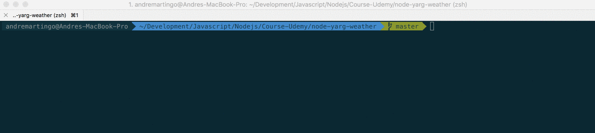

<p align="center">
  
</p>

[](https://travis-ci.org/AFGM/node-terminal-weather)

# Node.js Weather Terminal App
Node script to fetch weather based on a string.
It fetches the geolocation of that string in Google Maps API and then passes that data to another API call to darksky to get the current temperature of that location

## Goals
* Node.js
* Terminal
* Yargs
* HTTP Request
* Promises

## Instalation
```bash
$ git clone git@github.com:AFGM/node-terminal-weather.git
$ cd node-terminal-weather
$ npm install
```
## Usage
```bash
$ node app.js -a "some address or zip code or place"
```
## Demo

